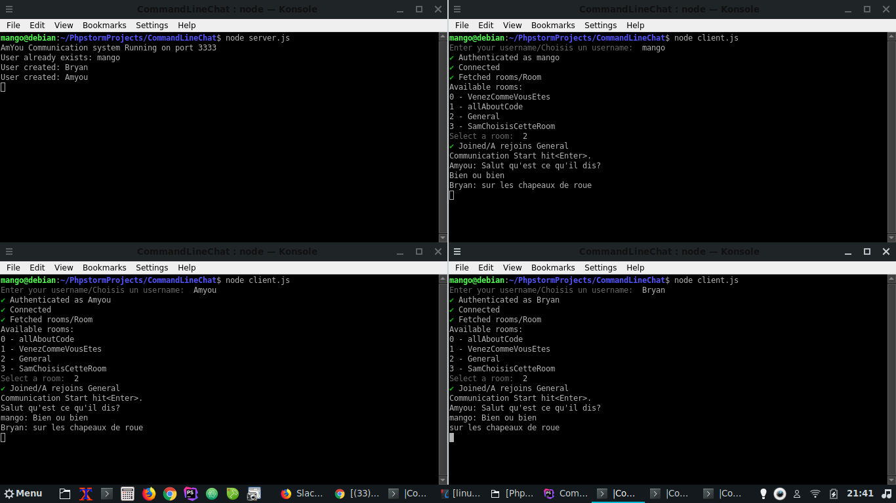

# Nodecommandlinechat with Pusher ChatKit 💬
> Terminal chat application built with Pusher Chatkit! 🚀

## Requirements
( Pour pouvoir tester en local il vous faut un compte Pusher et des "instance". 
Très simple a mettre en place, une fois fait follow the instruction ci-dessous ;) )

dans le dossier image un screen pour voir un peu comment ça marche ...
In the image file there is a screen to how this can render or look ...

Prior to running this locally, you'll need a Chatkit instance.

## Install

### Install dependencies
```
npm install
```

### Server
Edit `server.js`, replacing `YOUR_INSTANCE_LOCATOR` and `YOUR_KEY` with your **Instance Locator** and **Secret Key** respectively.

Run the auth server via:
```
node server.js
```

### Client
Create a user/room via the inspector in the Pusher Dashboard.

Edit `client.js`, replacing `YOUR_INSTANCE_LOCATOR` with your **Instance Locator**.

Run the client via:
```
node client.js
```
voila un Preview:

